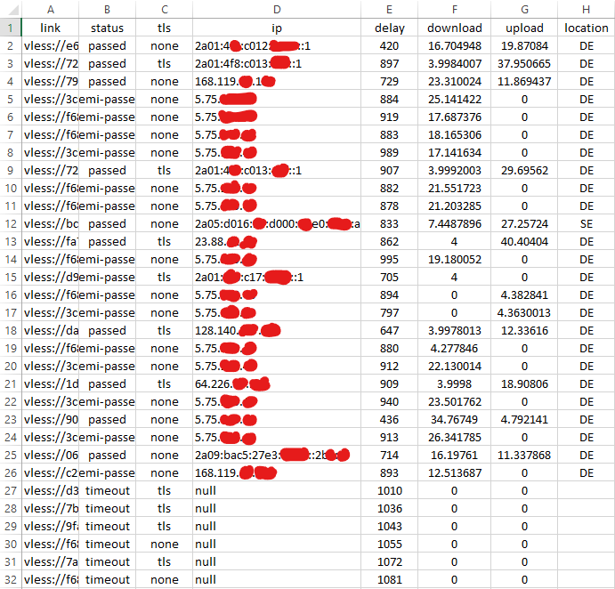
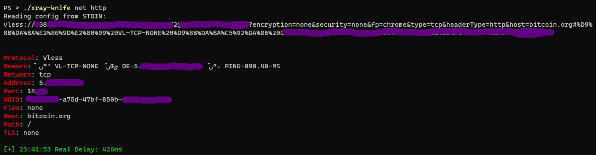

# xray-knife
Swiss army knife tool (cli) for [xray-core](https://github.com/XTLS/Xray-core).

**I DEDICATE THIS TOOL TO MY DEAR PERSIAN PEOPLE.**

**استفاده از این نرم افزار برای حمایت کنندگان جمهوری اسلامی حرام است.**

## Features (main flags)
- `parse`: Detailed info about given xray config link.
- `subs`: Subscription management tool.
- `net`: Network testing tools for one or multiple xray configs.
- `scan`: Scanning tools needed for bypassing GFW (CF Scanner, REALITY Scanner).
- `proxy`: Creates proxy server to work as a client for xray-core configs.

## Download

Get the latest version from [GitHub](https://github.com/lilendian0x00/xray-knife/releases/latest).

## Build instruction
Only tested on go version 1.20

1. `Install golang`
2. `git clone https://github.com/lilendian0x00/xray-knife.git`
3. `cd xray-knife`
4. `go build .`
    

# Screenshots
### http test CSV report

### http test log

# TODO
## protocols - parse
- [X] ~~Add Vmess link support (`vmess://...`, full b64 encoded)~~
- [X] ~~Add Vmess link v2 support (`vmess://...`, semi b64 encoded)~~
- [X] ~~Add Vless link support (`vless://...`)~~
- [X] ~~Add Shadowsocks support (`ss://...`)~~
- [X] ~~Add Trojan support (`trojan://...`)~~
- [ ] Load config from json file

## subs
- [X] ~~Fetch config links inside subscription~~
- [X] ~~Sort config links based on their real delay test when saving them into a file~~

## net
- [X] ~~Add icmp (ping) tester~~
- [X] ~~Add tcp connection delay tester~~
- [X] ~~Add full connection delay (AKA real delay) tester~~
- [X] ~~Add speed tester for http~~

## scan (under development)
- [ ] Cloudflare best IP finder (whitelist scanner)
- [ ] Xray REALITY scanner (TLS, H2)

## proxy (under development)
- [ ] Initialization

